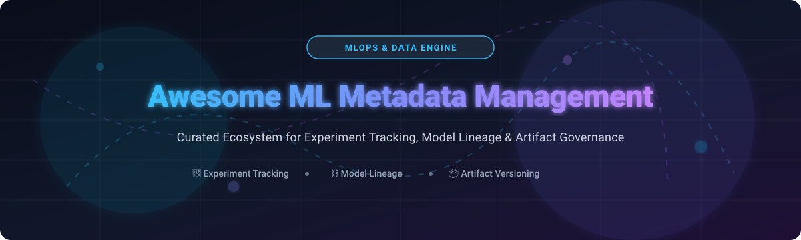

  

       

# 🚀 Awesome ML Metadata Management

> A curated ecosystem of **SaaS platforms** and **Open-Source tools** for **Machine Learning Metadata Management**, **Experiment Tracking**, **Model Lineage**, **Artifact Versioning**, and **MLOps Governance**.

---

## 🎯 Overview & Key Concepts

**ML Metadata Management** captures the operational, structural, and lineage data generated throughout the machine learning lifecycle. This repository provides an SEO-optimized, regularly updated list of top tools enabling AI/ML engineers and data scientists to:

* 🧪 **Track Experiments**: Log parameters, hyperparameters, metrics, and visualization outputs in real time.
* ⛓️ **Auditable Lineage**: Trace exact code commits, dataset versions, environments, and pipeline execution graphs.
* 📦 **Artifact & Model Registry**: Store and version model weights, features, datasets, and container images.
* 🛡️ **MLOps Governance**: Enforce compliance, reproducibility, and enterprise access control across model lifecycles.

---

## 📚 Table of Contents
- [📊 Market Overview & Sector Structure](#-market-overview--sector-structure)
- [☁️ SaaS & Hosted Managed Platforms](#️-saas--hosted-managed-platforms)
- [🔓 Open-Source GitHub Projects](#-open-source-github-projects)
- [💡 Architectural Guidance & Patterns](#-architectural-guidance--patterns)
- [🤝 How to Contribute](#-how-to-contribute)
- [💖 Support & Sponsorship](#-support--sponsorship)
- [📈 Star History](#-star-history)
- [📜 Disclaimer & License](#-disclaimer--license)

---

## 📊 Market Overview & Sector Structure

> 💡 **Market Estimate & Dynamics**: The global Machine Learning Metadata Management and MLOps market is estimated at **$1.8 Billion in 2026** and projected to reach **$6.5+ Billion by 2030** (CAGR ~30.5%). The market is **highly fragmented**, featuring specialized point-solution experiment trackers (e.g., Weights & Biases, Neptune.ai, Comet ML), open-core pipeline orchestrators (ClearML, ZenML), and hyperscaler cloud suites (AWS SageMaker ML Lineage, GCP Vertex AI Metadata). Because no single vendor controls the end-to-end stack, teams often adopt a modular architecture combining open-source metadata engines with hosted collaboration platforms.

---

## ☁️ SaaS & Hosted Managed Platforms

The table below lists top commercial and managed SaaS platforms, sorted by **Company Valuation / Revenue Size (Descending)**:

| 🏢 Platform / Product | 💰 Valuation / Company Size | 🏷️ Starting Pricing | 🎁 Free Tier Limits | 📌 Key Focus & Capabilities |
| :--- | :--- | :--- | :--- | :--- |
| **[Vertex AI Metadata](https://cloud.google.com/vertex-ai)** | **$2.1 Trillion** *(Alphabet Parent / ~$33B Cloud Rev)* | $0.02 per 1,000 metadata requests + $0.020/GB/mo storage | $300 free credits valid for 90 days for new Google Cloud accounts | Managed metadata & lineage service within GCP Vertex AI for tracking artifacts, execution graphs, and pipeline steps. |
| **[Amazon SageMaker ML Lineage](https://aws.amazon.com/sagemaker/)** | **$1.9 Trillion** *(Amazon Parent / ~$90B AWS Rev)* | $0.000024 per API call + $0.023/GB/mo storage | 2 months free of SageMaker Studio with 250 MB storage under AWS Free Tier | Native lineage tracking within AWS SageMaker for end-to-end dataset, model, and workflow relationship governance. |
| **[DataRobot MLOps](https://www.datarobot.com/)** | **$6.3 Billion** *(Valuation / $1B+ Funding)* | $25,000 / year base platform tier (~$2,083/mo) | 14-day free trial on DataRobot AI Cloud (up to 10 ML models) | Enterprise MLOps platform offering automated model registry, continuous monitoring, and lineage compliance. |
| **[Domino Data Lab](https://www.dominodatalab.com/)** | **$1.5 Billion** *(Valuation / $220M+ Funding)* | $85,000 / year enterprise tier (~$7,083/mo) | 14-day free trial on Domino Cloud (includes 2 concurrent workspaces & 100 GB storage) | Enterprise data science platform providing reproducible environments, experiment tracking, and governed metadata. |
| **[Weights & Biases](https://wandb.ai/)** | **$1.25 Billion** *(Valuation / $250M+ Funding)* | $50 / user / month *(Team Plan starting tier)* | Free Forever for personal research (1 user, 100 GB storage, unlimited personal projects); 14-day Team trial | Market leader for experiment tracking, hyperparameter sweeps, artifact versioning, and LLM observability. |
| **[ClearML Hosted](https://clear.ml/)** | **~$150 Million** *(Valuation / $50M+ Funding)* | $15 / user / month *(Pro Plan)* | Free Forever for up to 3 team members (100 GB storage, unlimited experiment runs) | Managed MLOps suite covering experiment tracking, auto-logging, dataset versioning, and execution scheduling. |
| **[Comet ML](https://www.comet.com/)** | **~$100 Million** *(Valuation / $60M+ Funding)* | $179 / month *(Startup / Team Plan)* | Free Forever for individual developers (1 user, 100 GB storage, unlimited public/private projects) | Robust experiment tracking, model management, LLM evaluation, and production performance monitoring. |
| **[DagsHub](https://dagshub.com/)** | **~$40 Million** *(Valuation / $13M+ Funding)* | $10 / user / month *(Pro Plan)* | Free Forever for up to 3 collaborators (10 GB storage, 2 hours cloud GPU compute/month) | Data science collaboration platform integrating Git, DVC, and MLflow for code, data, and experiment tracking. |
| **[Neptune.ai](https://neptune.ai/)** | **~$35 Million** *(Valuation / $10M+ Funding)* | $150 / month *(Team Plan)* | Free Forever for individual researchers (1 user, 200 GB storage, 100 execution hours/month) | Metadata-first tracking platform optimized for querying large experiment histories and run organization. |
| **[Valohai](https://valohai.com/)** | **~$30 Million** *(Valuation / $12M+ Funding)* | $500 / month *(Team Plan)* | 14-day free trial (full feature access with 10 hours compute credit) | MLOps platform managing pipelines, compute infrastructure, and experiments with deep data lineage capture. |
| **[ZenML Cloud](https://www.zenml.io/)** | **~$25 Million** *(Valuation / $6.4M+ Funding)* | $49 / month *(Pro Starter Plan)* | 14-day free trial (full Pro features, up to 5 pipelines & 1,000 runs) / Free self-hosted OS edition | Managed control plane around the ZenML pipeline framework with automated metadata and artifact tracking. |
| **[AimStack (Hosted Aim)](https://aimstack.io/)** | **~$15 Million** *(Valuation / $4.5M+ Funding)* | $30 / user / month *(Hosted Pro Plan)* | 14-day free cloud trial / Free open-source self-hosted edition | Ultra-fast UI and metadata exploration platform designed for deep run comparison and metric visualization. |

---

## 🔓 Open-Source GitHub Projects

Below is a list of top open-source projects for ML Metadata Management, sorted by **GitHub Star Count (Descending)**:

1. 🌟 **[MLflow](https://github.com/mlflow/mlflow)** —   
   *Leading open-source AI engineering platform for experiment tracking, model registry, prompt evaluation, and LLM tracing. Fully self-hostable.*

2. 🌟 **[DVC (Data Version Control)](https://github.com/iterative/dvc)** —   
   *Git-based open-source data and model version control with experiment tracking capabilities; forms the bedrock for reproducibility.*

3. 🌟 **[Great Expectations](https://github.com/great-expectations/great_expectations)** —   
   *Open-source data quality, validation, and metadata profiling platform ensuring reliable data pipelines for machine learning.*

4. 🌟 **[Flyte](https://github.com/flyteorg/flyte)** —   
   *Dynamic, resilient AI orchestration platform that tracks execution graphs, data lineage, and metadata across workflows.*

5. 🌟 **[Feast](https://github.com/feast-dev/feast)** —   
   *The leading open-source feature store for machine learning, managing feature metadata, point-in-time joins, and online/offline serving.*

6. 🌟 **[ClearML](https://github.com/allegroai/clearml)** —   
   *Auto-magical open-source MLOps suite featuring experiment tracking, data management, orchestration, and model serving.*

7. 🌟 **[Aim](https://github.com/aimhubio/aim)** —   
   *An easy-to-use, supercharged open-source experiment tracker with a high-performance UI for exploring massive experiment runs.*

8. 🌟 **[ZenML](https://github.com/zenml-io/zenml)** —   
   *Extensible open-source MLOps framework that connects ML pipelines with automatic metadata logging and artifact lineage.*

9. 🌟 **[lakeFS](https://github.com/treeverse/lakeFS)** —   
   *Git-like data version control for object stores and data lakes, tracking dataset commits, branches, and metadata lineage.*

10. 🌟 **[Sacred](https://github.com/IDSIA/sacred)** —   
    *Lightweight open-source Python tool for configuring, organizing, logging, and reproducing machine learning experiments.*

11. 🌟 **[Polyaxon](https://github.com/polyaxon/polyaxon)** —   
    *Open-source platform for orchestrating, tracking, and managing machine learning experiments on Kubernetes.*

12. 🌟 **[MLRun](https://github.com/mlrun/mlrun)** —   
    *Open-source MLOps orchestration platform integrating data engineering, model training, tracking, and serving into continuous applications.*

13. 🌟 **[Guild AI](https://github.com/guildai/guildai)** —   
    *Zero-code-modification experiment tracking and developer tool for machine learning workflows.*

14. 🌟 **[Google ML Metadata (MLMD)](https://github.com/google/ml-metadata)** —   
    *C++/Python library for recording and retrieving ML workflow artifacts and lineage; powers TFX and Kubeflow Pipelines.*

---

## 💡 Architectural Guidance & Patterns

* **Zero Vendor Lock-In**: Start with open-source options like **MLflow**, **DVC**, or **ClearML** for full control over metadata storage and artifact hosting.
* **Pipeline Coupling**: Use **ZenML**, **Flyte**, or **ClearML** when metadata tracking must be embedded directly into pipeline orchestration.
* **Deep Experiment Visualization**: Combine **Aim** or **Weights & Biases** for real-time loss curves, hyperparameter sweeps, and LLM token tracing.
* **Hybrid Enterprise Setup**: Self-host an open-source metadata store (e.g. MLMD or MLflow) in VPCs for strict privacy while federating selective metrics to cloud dashboards for team collaboration.

---

## 🤝 How to Contribute

Contributions are welcome! Please follow these steps to add or update entries:

1. Fork this repository.
2. Edit `README.md` maintaining table formatting, pricing specs, and star badges.
3. Keep descriptions factual, unbiased, and include official project/site links.
4. Open a Pull Request with a clear description of your changes.

Check out our [Awesome-Awesome-Awesome](https://github.com/ishandutta2007/Awesome-Awesome-Awesome) curated index for more developer lists!

---

## 💖 Support & Sponsorship

If you find this repository helpful, please consider supporting the project!

- ⭐ **Star** this repository on GitHub.
- 🔀 **Fork** and share with your MLOps team or community.
- ☕ **Sponsor / Buy a Coffee**: Support ongoing maintenance via [GitHub Sponsors](https://github.com/sponsors/ishandutta2007).

---

## 📈 Star History

---

## 📜 Disclaimer & License

* This repository is community-curated and provided for informational purposes.
* All trademarks belong to their respective owners.
* Distributed under the MIT License.

---

  <i>Maintained with ❤️ by <a href="https://github.com/ishandutta2007">Ishan Dutta</a> for MLOps and Machine Learning Engineers.</i>

